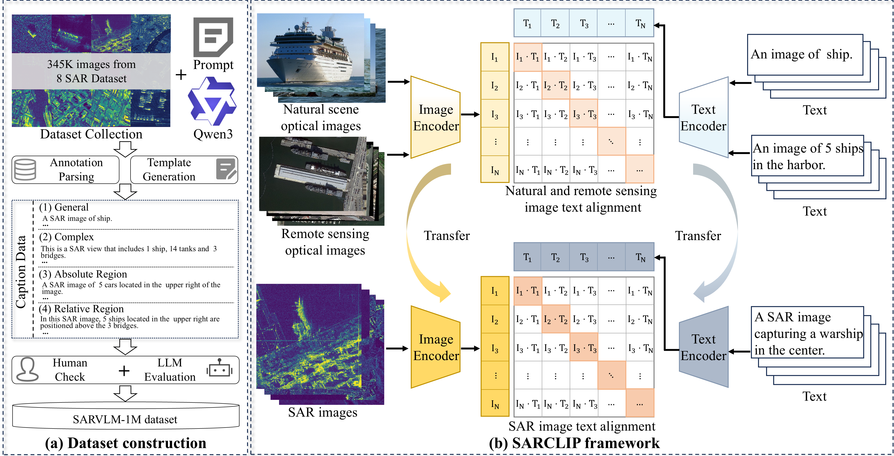
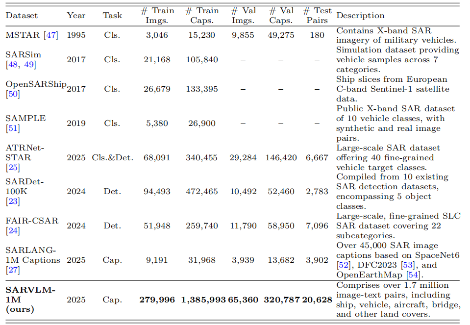
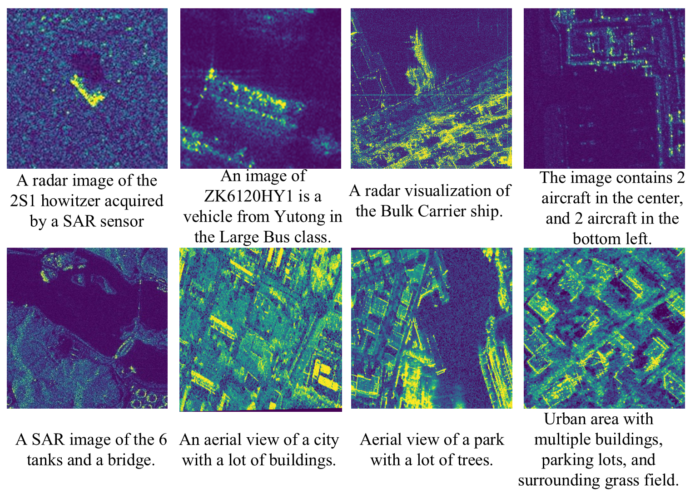

<div align="center">

# SARVLM

[](https://arxiv.org/abs/2510.22665)


**A streamlined public release for SAR vision-language evaluation and reproducibility**

This repository provides the core code and resources needed to reproduce the evaluation results of SARVLM, together with visualization utilities, dataset links, and checkpoint links for `SARCLIP` and `SARCoCa`.

[[Paper](https://arxiv.org/abs/2510.22665)] [[Dataset](#data-and-weights)] [[Checkpoints](#data-and-weights)] [[Evaluation](#evaluation)] [[Citation](#citation)]

</div>

## 🧭 Contents

- [News](#news)
- [Overview](#overview)
- [Framework](#framework)
- [Dataset](#dataset)
- [Visualization](#visualization)
- [Main Contributions](#main-contributions)
- [Release Note](#release-note)
- [Installation](#installation)
- [Data and Weights](#data-and-weights)
- [Reproducibility](#reproducibility)
- [Evaluation](#evaluation)
- [Supported / Referenced Datasets](#supported--referenced-datasets)
- [Compared / Referenced Methods](#compared--referenced-methods)
- [Acknowledgement](#acknowledgement)
- [Citation](#citation)
- [License](#license)

<a id="news"></a>
## 📢 News

- Paper: [arXiv:2510.22665](https://arxiv.org/abs/2510.22665)
- We have simplified the public codebase and retained the core evaluation pipeline for reproducibility.
- Our journal submission is currently under review.
- At this stage, please cite the arXiv version of our work.
- Evaluation code, dataset links, and checkpoints are available. Additional components will be synchronized later.

<a id="overview"></a>
## 📘 Overview

SARVLM is a project for SAR-oriented vision-language modeling. It combines a large-scale image-text dataset, a transfer strategy bridging natural images, optical remote sensing, and SAR imagery, and two model components: `SARCLIP` for representation learning and `SARCoCa` for caption generation. The resulting framework supports retrieval, recognition, zero-shot classification, semantic localization, and captioning in SAR scenarios.

<a id="framework"></a>
## 🏗️ Framework



The core pipeline contains three main parts:

- `SARVLM-1M`: a large-scale SAR image-text dataset for multimodal learning
- `Two-stage domain transfer`: natural image -> optical remote sensing -> SAR
- `SARVLM`: a SAR-oriented foundation model family including `SARCLIP` and `SARCoCa`

<a id="dataset"></a>
## 🗂️ Dataset

### 🧩 Dataset Composition



`SARVLM-1M` is constructed from multiple SAR and remote sensing resources and is designed for multimodal pretraining, retrieval, semantic understanding, and captioning research.

### 🖼️ Dataset Examples



The dataset contains diverse image-text pairs covering targets, ships, ground objects, scenes, and semantic descriptions from different SAR sources.

<a id="visualization"></a>
## 📈 Visualization

### 🖼️ Heatmap Visualization


We provide visualization scripts for feature analysis, including patch-text similarity and feature-distribution inspection, to better understand the semantic alignment behavior of SARVLM models.

<a id="main-contributions"></a>
## ✨ Main Contributions

- We construct `SARVLM-1M`, a large-scale SAR vision-language dataset with over one million image-text pairs.
- We propose a two-stage domain transfer training strategy to bridge natural images, optical remote sensing imagery, and SAR imagery.
- We develop `SARVLM`, including `SARCLIP` and `SARCoCa`, for SAR semantic understanding and caption generation.
- We introduce an ensemble strategy to improve cross-scene generalization.
- We validate the framework on retrieval, target recognition, zero-shot classification, semantic localization, and caption generation tasks.

<a id="release-note"></a>
## 📌 Release Note

> This is a simplified public release of SARVLM.
>
> We retain the evaluation code used in our paper, including image-text retrieval, zero-shot classification, caption generation, and semantic localization, so that readers can reproduce the reported results more easily.
>
> The original model development pipeline is based on `OpenCLIP`. This public repository is intentionally kept compact and evaluation-oriented, while the method remains reproducible with the released datasets, checkpoints, evaluation code, and the settings described in the paper.

<a id="installation"></a>
## 🛠️ Installation

We recommend Python `3.9+` and a PyTorch environment with CUDA support.

### Minimal Evaluation Setup

```bash
conda create -n sarvlm python=3.10 -y
conda activate sarvlm

pip install -U pip
pip install -r requirements.txt
pip install -e .

export PYTHONPATH="$(pwd)/src:${PYTHONPATH}"
```

### Optional Full Environment

```bash
pip install -r requirements-training.txt
pip install -r requirements-test.txt
```

For most users, this public release is intended for evaluation and result reproduction. The minimal setup above is sufficient in typical cases.

<a id="data-and-weights"></a>
## 📥 Data and Weights

The experimental data and model checkpoints are available via Baidu Netdisk.

| Resource | Description | Download | Code |
| --- | --- | --- | --- |
| `SARVLM Dataset` | SARVLM data release | [Baidu Netdisk](https://pan.baidu.com/s/1RfQBMxgFquesDeDDNkYuRw) | `p66p` |
| `SARCLIP Checkpoints` | Retrieval / recognition model weights | [Baidu Netdisk](https://pan.baidu.com/s/1_tF_1COKFw_l02HCzBD2YA) | `iutk` |
| `SARCoCa Checkpoints` | Captioning model weights | [Baidu Netdisk](https://pan.baidu.com/s/1mOYK8ningxxd3d0b_Y5i3g) | `ungv` |

<a id="reproducibility"></a>
## 🔄 Reproducibility

`SARCLIP` and `SARCoCa` are developed on top of `OpenCLIP`. Although this repository is a streamlined public release rather than a full internal workspace dump, the overall method remains reproducible with the released dataset resources, checkpoints, evaluation code, and the settings described in the paper.

<a id="evaluation"></a>
## 📊 Evaluation

The public `eval/` directory has been simplified and now contains the core evaluation code used for result reproduction in our paper.

| Task | Main Script | Main Metrics |
| --- | --- | --- |
| Image-text retrieval | `eval/RET/eval_retrieval.py` | `R@1`, `R@5`, `R@10`, `MeanRecall` |
| Zero-shot classification | `eval/zeroshot/eval_zeroshot.py` | `Top-1`, `Top-3`, `Top-5`, `Mean Per-class Accuracy` |
| Caption generation | `eval/Caption/evaluate_coca_simple.py` | `BLEU`, `METEOR`, `ROUGE-L`, `CIDEr`, `SPICE` |
| Semantic localization | `eval/SeLo/SeLo_test_and_save.py` | localization outputs |

### 🔎 1. Image-text Retrieval

**Files**

- Main: `eval/RET/eval_retrieval.py`
- Helper: `eval/RET/run.sh`

**Method**

- The script reads a CSV file with paired `imgpath` and `caption`.
- It extracts normalized image features and text features.
- It computes an image-text similarity matrix by cosine similarity.
- It reports `I2T_R@1`, `I2T_R@5`, `I2T_R@10`, `T2I_R@1`, `T2I_R@5`, `T2I_R@10`, and overall `MeanRecall`.

**Example**

```bash
python eval/RET/eval_retrieval.py \
  --model ViT-L-14 \
  --checkpoint /path/to/checkpoint.pt \
  --data-csv /path/to/eval.csv \
  --batch-size 32 \
  --device cuda
```

### 🏷️ 2. Zero-shot Classification

**Files**

- Main: `eval/zeroshot/eval_zeroshot.py`
- Helper: `eval/zeroshot/run.sh`

**Method**

- The script treats each subdirectory under the dataset root as a category.
- It builds text classifiers from prompt templates such as `sar`, `optical`, `sar_opt`, and `isprs`.
- It extracts image features and text prototypes, then performs zero-shot matching.
- It reports `Top-1 Accuracy`, `Top-3 Accuracy`, `Top-5 Accuracy`, `Per-class Accuracy`, `Mean Per-class Accuracy`, and confusion-matrix-related outputs.
- It also supports common SAR image formats, including `tif` and `tiff`.

**Example**

```bash
python eval/zeroshot/eval_zeroshot.py \
  --model ViT-L-14 \
  --checkpoint /path/to/checkpoint.pt \
  --data-root /path/to/dataset \
  --templates sar \
  --batch-size 32 \
  --device cuda
```

### 📝 3. Caption Generation

**Files**

- Main: `eval/Caption/evaluate_coca_simple.py`
- Metric script: `eval/Caption/eval_bertscore.py`
- Helpers: `eval/Caption/eval.sh`, `eval/Caption/run_bert.sh`

**Method**

- The script loads a `coca_*` model checkpoint.
- It generates captions for each input image.
- It compares generated captions with reference captions from CSV annotations.
- It saves generated captions, JSON summaries, and text summaries for easier inspection.
- It reports captioning metrics such as `BLEU`, `METEOR`, `ROUGE-L`, `CIDEr`, and `SPICE`.

**Example**

```bash
python eval/Caption/evaluate_coca_simple.py \
  --model coca_ViT-L-14 \
  --checkpoint /path/to/checkpoint.pt \
  --csv /path/to/eval.csv \
  --output /path/to/output
```

### 📍 4. Semantic Localization

**File**

- `eval/SeLo/SeLo_test_and_save.py`

This file is retained as part of the simplified public release for semantic localization evaluation and result export.

### 🧪 5. Linear Probing

The linear probing experiments depend on [`Wise-FT`](https://github.com/mlfoundations/wise-ft). Please refer to the official `Wise-FT` codebase for implementation details and experiment setup.

### 🛰️ 6. Detection

The detection experiments depend on [`MMDetection`](https://github.com/open-mmlab/mmdetection). The corresponding code and configuration will be synchronized in a later update.

<a id="supported--referenced-datasets"></a>
## 🗃️ Supported / Referenced Datasets

We thank the authors and maintainers of the datasets and data resources used to build, extend, or benchmark SARVLM, including:

- `MSTAR`
- `SARSim`
- `OpenSARShip`
- `SAMPLE`
- [ATRNet](https://github.com/waterdisappear/ATRNet-STAR)
- [SARDet-100k](https://github.com/zcablii/sardet_100k)
- [FAIR-CSAR](https://radars.ac.cn/web/data/getData?newsColumnId=59937a70-2a40-4027-a32d-df36753bf6ae&pageType=en)
- [SARLANG-1M-Caption](https://github.com/jimmyxichen/sarlang-1m)

<a id="compared--referenced-methods"></a>
## 🧠 Compared / Referenced Methods

We also thank the excellent prior works and open-source projects that inspired our implementation, training setup, or experimental comparisons:

- [OpenCLIP](https://github.com/mlfoundations/open_clip)
- [Wise-FT](https://github.com/mlfoundations/wise-ft)
- [RemoteCLIP](https://github.com/ChenDelong1999/RemoteCLIP)
- [GeoRSCLIP](https://github.com/om-ai-lab/RS5M)
- [HQRS-210K](https://github.com/YiguoHe/HQRS-210K-and-HQRS-CLIP)
- [SkyCLIP](https://github.com/wangzhecheng/skyscript)
- [SARCLIP-isprs](https://github.com/CAESAR-Radi/SARCLIP)
- [SAR-TEXT](https://github.com/YiguoHe/SAR-TEXT/)

<a id="acknowledgement"></a>
## 🙏 Acknowledgement

This project is built on top of several open-source efforts from the vision-language and remote sensing communities. We sincerely thank all authors who released code, models, datasets, and benchmarks that made this work possible.

<a id="citation"></a>
## 📝 Citation

Our journal version is under review. Please cite the current arXiv version for now:

```bibtex
@article{ma2025sarvlm,
  title={SARVLM: A vision language foundation model for semantic understanding and target recognition in SAR imagery},
  author={Ma, Qiwei and Wang, Zhiyu and Liu, Wang and Lu, Xukun and Deng, Bin and Duan, Puhong and Kang, Xudong and Li, Shutao},
  journal={arXiv preprint arXiv:2510.22665},
  year={2025}
}
```

<a id="license"></a>
## 📄 License

This repository currently follows the license terms included in this codebase. Please also pay attention to the original licenses of upstream projects and third-party datasets.
